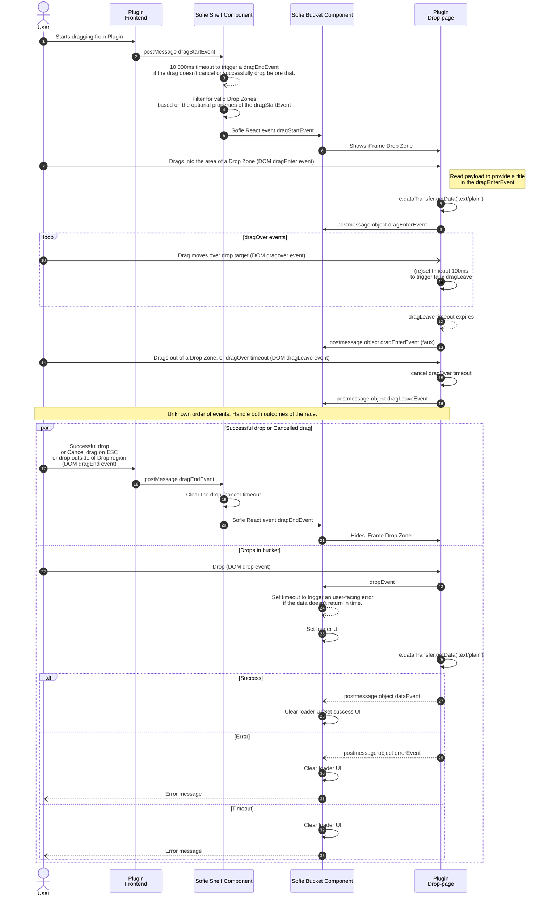

# iFrames MOS-plugins

**The usage of MOS-plugins allow micro frontends to be injected into Sofie for the purpuse of adding content to the production without turning away from the Sofie UI.**

Example use cases can be browsing and playing clips straight from a video server, or the creation of lower third graphics without storing it in the NRCS.

:::note MOS reference
[5.3 MOS Plug-in Communication messages](https://mosprotocol.com/wp-content/MOS-Protocol-Documents/MOSProtocolVersion40/index.html#calibre_link-61)

The link points at MOS documentations for MOS 4 (for the benefit of having the best documentation), but will be compatible with most older versions too.
:::

## Bucket items workflow

MOS-plugins are managed through the Shelf-system. They are added as `external_frame` either as a Tab to a Rundown layout or as a Panel to a Dashboard layout.

A video server browser plugin shown as a tab in the rundown layout shelf.

The user can create one or more Buckets. From the plugin they can drag-and-drop content into the buckets. The user can manage the buckets and their content by creating, renaming, re-arranging and deleting. More details available at the [Bucket concept description.](/docs/user-guide/concepts-and-architecture#buckets)

## Cross-origin drag-and-drop

:::note Bucket workflow without drag-and-drop
The plugin iFrame can send a `postMessage` call with an `ncsItem` payload to programatically create an ncsItem without the drag-and-drop interaction. This is a viable solution which avoids cross-origin drag-and-drop problems.
:::

### The problem

**Web browsers prevent drops into a webpage if the drag started from a page hosted on another origin.**

This means that drag-and-drop must happen between pages from the same origin. This is relevant for MOS-plugins, as they are supposed to be displayed in iFrames. Specifically, this means that the plugin in the iFrame must be served from the same origin as the parent page (where the drop will happen).

There are no properties or options to bypass this from within HTML/Javascript. Bypassing is theoretically possible by overriding the browser's security settings, but this is not recommended.

:::note Background
The background for the policy is discussed in this Chromium Issue from 2010: [Security: do not allow on-page drag-and-drop from non-same-origin frames (or require an extra gesture)](https://issues.chromium.org/issues/40083787)
:::

:::note What counts as different origins?
| Sofie Server Domain | Plugin Domain | Cross-origin or Same-origin? |
| ------------------- | ------------- | ---------------------------- |
| `https://mySofie.com:443` | `https://myPlugin.com:443` | cross-origin: different domains |
| | `https://www.mySofie.com:443` | cross-origin: different subdomains |
| | `https://myPlugin.mySofie.com:443` | cross-origin: different subdomains |
| | `http://mySofie.com:443` | cross-origin: different schemes |
| | `https://mySofie.com:80` | cross-origin: different ports |
| | `https://mySofie.com:443/myPlugin` | same-origin: domain, scheme and port match |
| | `https://mySofie.com/myPlugin` | same-origin: domain, scheme and port match (https implies port 443) |

:::

#### The "proxy idea"

As you can tell from the table, you need to exactly match both the protocol, domain and port number. More importantly, different subdomains trigger the cross-origin policy.

_The proxy idea_ is to use rewrite-rules in a proxy server (e.g. NGINX) to serve the plugin from a path on the Sofie server's domain. As this can't be done as subdomains, that leaves the option of having a folder underneath the top level of the Sofie server's domain.

An example of this would be to serve Sofie at `https://mysofie.com` and then host the plugin (directly or via a proxy) at `https://mysofie.com/myplugin`. Technically this will work, but this solution is fragile. All links within the plugin will have to be either absolute or truly relative links that take the URL structure into account. This is doable if the plugin is being developed with this in mind. But it leads to a fragile tight coupling between the plugin and the host application (Sofie) which can break with any inconsiderate udate in the future.

:::note Example of linking from a (potentially proxied) subfolder
**Case:** `https://mysofie.com/myplugin/index.html` wants to acccess `https://mysofie.com/myplugin/static/images/logo.png`.

Normally the plugin would be developed and bundled to work standalone, resulting in a link relative to its own base path, giving `/static/images/logo.png` which here wrongly resolves to `https://mysofie.com/static/images/logo.png`.

The plugin would need to use either use the absolute `https://mysofie.com/myplugin/static/images/logo.png` or the relative `images/static/logo.png` or `./images/static/logo.png` or even `/myplugin/static/images/logo.png` to point to the right resource.
:::

### The solution

**Sofie proposes a drag-and-drop/postMessage hybrid interface.**
In this model the user interactions of drag-and-drop are targeting a dedicated Drop page served by the plugin-server (same-origin to the plugin). This can be transparently overlaid the real drop region and intercept drop events. The Bucket system has built-in support for this, configured as an additional property to the External frame panel setup in Shelf config.

The true communication channel between the plugin and Sofie becomes a postMessage protocol where the plugin is managing all drag-and-drop events and converts them into the postMessage protocol. Sofie also handles edge cases such as timeouts, drag leaving the browser etc.

### Sequence diagram

#### Post-messages from the Plugin (drag-side)

| Message   | Payload | Description                                                                                                                                                                       |
| --------- | ------- | --------------------------------------------------------------------------------------------------------------------------------------------------------------------------------- |
| dragStart | -       | Re-sends the DOM event dragStart as a postMessage of the same kind.   This is the signal to Sofie to toggle on the Drop-zone and indicate in the UI that a drag is happening. |
| dragEnd   | -       | Re-sends the DOM event dragEnd as a postMessage of the same kind.   This is the signal to Sofie to toggle off the Drop-zone and reset the UI.                                 |

#### Post-messages from the Plugin Drop-page

| Message   | Payload                               | Description                                                                                                                                                       |
| --------- | ------------------------------------- | ----------------------------------------------------------------------------------------------------------------------------------------------------------------- |
| dragEnter | `{event: 'dragEnter', label: string}` | To set the UI to reflect an object is being dragged into a specific bucket.   The label property can be used for showing a simple placeholder in the bucket. |
| dragLeave | `{event: 'dragLeave'}`                | To reset any UI.                                                                                                                                                  |
| drop      | `{event: 'drop'}`                     | To synchronously react to the drop in the UI.                                                                                                                     |
| data      | `{event: 'data', data: ncsItem}`      | To (a)synchronously receive the payload.   The expected format is an `ncsItem` MOS message (XML string)                                                      |
| error     | `{event: 'error', message}`           | To cancel the drag-operation and handle any errors.                                                                                                               |

:::note Please note
Please note how all interactions are happening over the postMessage interface.
No DOM-driven drag-n-drop events are relevant for Sofie, as they are solely handled between the plugin and its drop-page.
:::

#### Minimal example sequence - happy path

Don't worry, the sequence diagram shows a lot more detail than you need to think about. Consider this simple happy-path sequence as a representative interaction between the 3 actors (Plugin, Drop-page and Sofie):

1. Plugin `dragStart`
2. Drop-page `dragEnter`
3. Plugin `dragEnd` and Drop-page `drop`
4. Drop-page `data`
